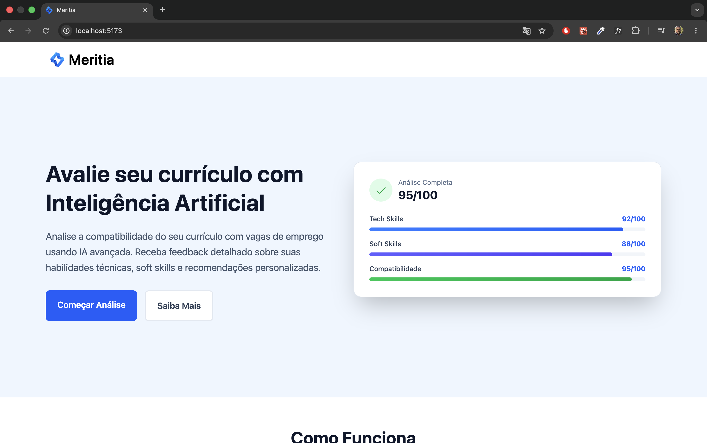
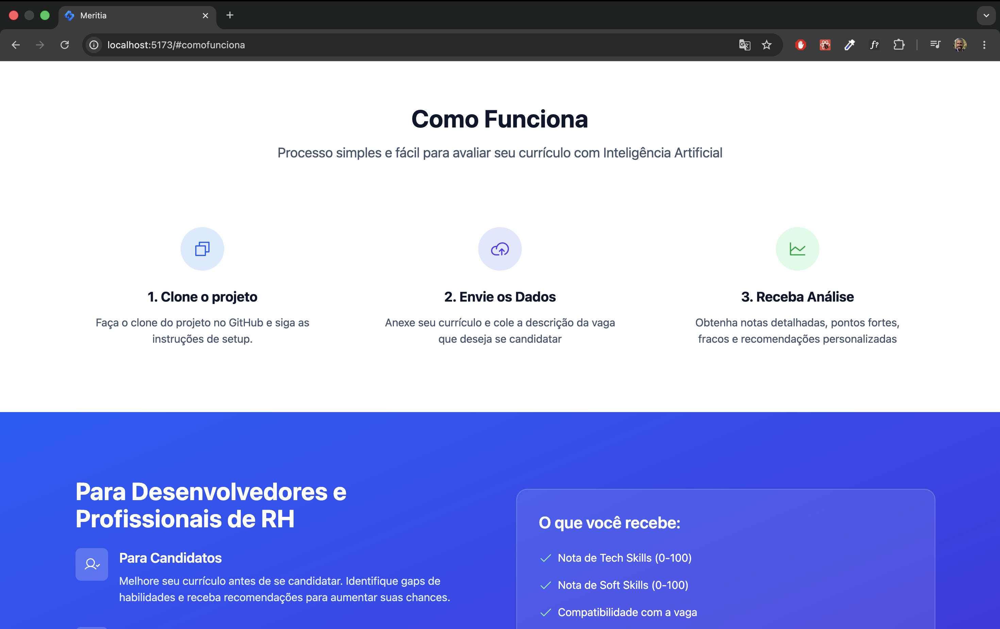
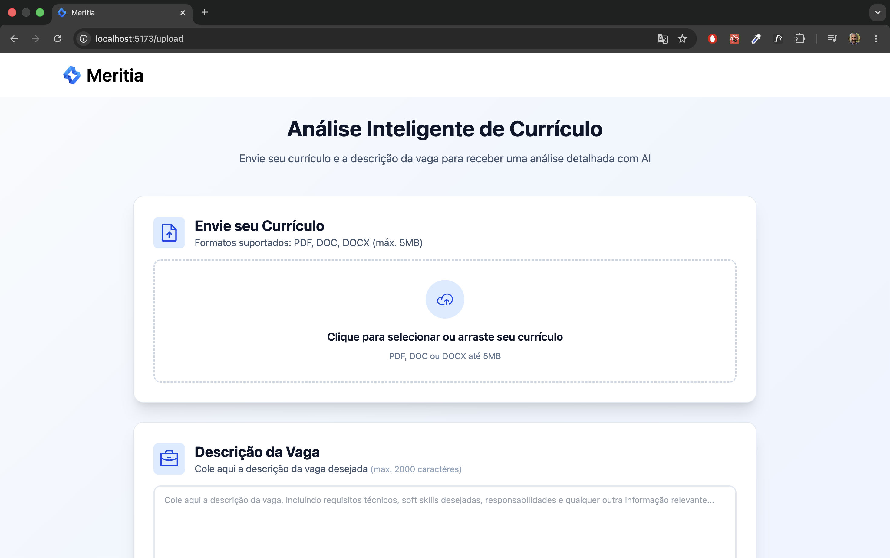
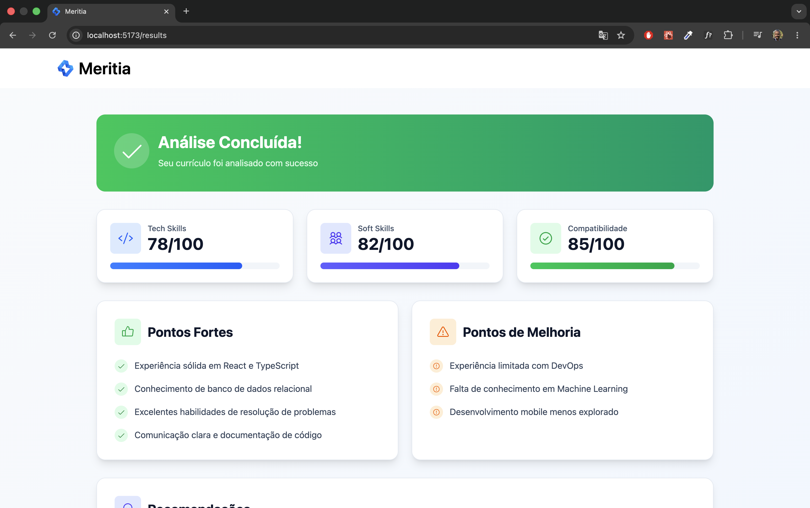

# Meritia


Uma plataforma web inteligente que analisa a compatibilidade entre seu currículo e as vagas de emprego desejadas, utilizando Inteligência Artificial do Google Gemini.

## 📋 Sumário

- [Visão Geral](#visão-geral-)
- [Funcionalidades](#funcionalidades-)
- [Tecnologias Utilizadas](#tecnologias-utilizadas)
- [Pré-requisitos](#pré-requisitos-)
- [Guia de Instalação](#guia-de-instalação-)
- [Configuração](#configuração)
- [Como Executar](#como-executar)
- [Estrutura do Projeto](#estrutura-do-projeto-)
- [Como Funciona](#como-funciona-)
- [Endpoints da API](#endpoints-da-api-)
- [Screenshots](#screenshots-)
- [Autor](#autor-)
- [Suporte e Troubleshooting](#suporte-e-troubleshooting-)

---

## Visão Geral 🎯

**Meritia** é uma plataforma que utiliza Inteligência Artificial para análise profunda de compatibilidade entre currículo e vagas. A aplicação processa documentos (PDF, DOC e DOCX), extrai dados relevantes e fornece uma avaliação detalhada incluindo:

- **Score de Tech Skills**: Avaliação das habilidades técnicas
- **Score de Soft Skills**: Avaliação de habilidades comportamentais
- **Compatibilidade com a Vaga**: Percentual de alinhamento geral
- **Pontos Fortes**: Principais competências identificadas
- **Pontos de Melhoria**: Áreas que precisam desenvolvimento
- **Recomendações**: Sugestões personalizadas para melhorar o perfil
- **Relatório em PDF**: Documento completo pronto para download (EM DESENVOLVIMENTO...)

---

## Funcionalidades ✨

✅ Upload de currículo em PDF ou DOCX  
✅ Análise inteligente com Google Gemini
✅ Avaliação de compatibilidade com a vaga  
✅ Score detalhado de skills técnicas e soft skills  
✅ Recomendações personalizadas  
✅ Interface responsiva para uso mobile
✅ Suporte a múltiplos formatos de arquivo  
✅ Processamento seguro com validação de dados  
✅ Rate limiting para proteção da API

---

## Tecnologias Utilizadas 🛠️

### Backend

- **Node.js** - Runtime JavaScript
- **NestJS** - Framework backend robusto
- **TypeScript** - Tipagem estática
- **Google Gemini** - IA para análise
- **Express** - Servidor web
- **Multer** - Upload de arquivos
- **PDF Parse** - Extração de texto de PDFs
- **Mammoth** - Extração de texto de DOCX
- **PDF Lib** - Geração de PDFs
- **Class Validator** - Validação de dados
- **Helmet** - Segurança HTTP
- **CORS** - Compartilhamento de recursos

### Frontend

- **React 19** - Biblioteca UI
- **TypeScript** - Tipagem estática
- **Vite** - Build tool moderno
- **React Router** - Navegação entre páginas
- **Axios** - Cliente HTTP
- **Tailwind CSS** - Framework CSS utility-first
- **Phosphor Icons** - Biblioteca de ícones

### Infraestrutura

- **Docker** - Containerização
- **Docker Compose** - Orquestração de containers
- **Yarn** - Gerenciador de pacotes (workspaces monorepo)

---

## Pré-requisitos 📦

Antes de começar, certifique-se de ter instalado:

- **Node.js** (versão 24 ou superior) - [Download](https://nodejs.org/)
- **Yarn** (versão 4.12.0 ou superior) - `npm install -g yarn@4.12.0`
- **Git** - [Download](https://git-scm.com/)
- **Docker** (opcional, para rodar com containers) - [Download](https://www.docker.com/)
- **Conta Google com acesso ao Google AI Studio** - [Acessar](https://aistudio.google.com/)

Para verificar as instalações:

```bash
node --version
yarn --version
git --version
docker --version  # (opcional)
```

---

## Guia de Instalação 🚀

### 1. Clone o Repositório

```bash
git clone https://github.com/SamuelSRJ/meritia.git
cd meritia
```

### 2. Instale as Dependências

```bash
yarn install
```

Este comando instalará todas as dependências do projeto, incluindo backend e frontend (usando Yarn workspaces).

### 3. Obtenha a Chave de API do Google Gemini

**Passo a passo:**

1. Acesse [Google AI Studio](https://aistudio.google.com/)
2. Efetue login com sua conta Google (ou crie uma nova)
3. No canto inferior esquerdo, clique em **"Get API Key"**
4. Clique em **"Create API Key"** no canto superior direito
5. Configure:
   - Dê um nome para a chave
   - (Opcional) Crie um novo projeto
6. Copie a chave gerada
7. Crie o arquivo `.env` na raiz do backend e cole a chave da API como no arquivo `.env.example`

> **⚠️ Importante:** A chave de API é gratuita e não requer cartão de crédito. O modelo Gemini 2.5 Flash oferece:
>
> - Análises limitadas na camada gratuita
> - Sem necessidade de pagamento
> - Sem necessidade de cadastro de cartão de crédito

> Caso você tenha acesso a algum outro modelo pago, fique a vontade para utiliza-lo.

### 4. Configure as Variáveis de Ambiente

Crie um arquivo `.env` na raiz do projeto, do frontend e do backend com base nos arquivos `.env.example` de cada um:

```bash
# Copiar o arquivo de exemplo
cp .env.example .env
```

Edite o arquivo `.env` e adicione suas configurações:

```env
# Gemini API Configuration
GEMINI_API_KEY=sua_chave_de_api_aqui

# Backend Configuration
PORT=4000
NODE_ENV=development
```

---

## Configuração ⚙️

### Estrutura de Ambiente

O projeto utiliza um setup de **monorepo com Yarn workspaces** contendo:

```
job-match-assistant/
├── apps/
│   ├── backend/          # API NestJS
│   └── frontend/         # Interface React
├── .env                  # Variáveis de ambiente (criar)
├── .env.example          # Template de exemplo
├── docker-compose.yml    # Orquestração Docker
└── package.json          # Configuração de workspaces
```

### Variáveis de Ambiente Disponíveis

| Variável         | Descrição                     | Exemplo                       |
| ---------------- | ----------------------------- | ----------------------------- |
| `GEMINI_API_KEY` | Chave de API do Google Gemini | `AIzaXXXXXXXXXX...`           |
| `PORT`           | Porta do servidor backend     | `4000`                        |
| `NODE_ENV`       | Ambiente de execução          | `development` ou `production` |
| `VITE_API_URL`   | URL da API (frontend)         | `http://localhost:4000`       |

---

## Como Executar ▶️

### Opção 1: Desenvolvimento Local (Recomendado)

Execute tanto frontend quanto backend em paralelo com um único comando:

```bash
yarn dev
```

Isso iniciará:

- **Frontend**: http://localhost:5173 (abre automaticamente)
- **Backend**: http://localhost:4000

A aplicação está pronta para uso! Ambos os serviços executam com hot reload.

### Opção 2: Desenvolvimento Separado

Se preferir executar separadamente:

**Terminal 1 - Backend:**

```bash
yarn workspace backend dev
```

Backend disponível em: http://localhost:4000

**Terminal 2 - Frontend:**

```bash
yarn workspace frontend dev
```

Frontend disponível em: http://localhost:5173

### Opção 3: Docker (Produção)

Para executar a aplicação completa em containers Docker:

```bash
docker-compose up --build
```

A aplicação estará disponível em:

- **Frontend**: http://localhost:3000
- **Backend API**: http://localhost:4000

#### Comandos Docker Úteis:

```bash
# Construir containers
docker-compose build

# Executar em background
docker-compose up -d

# Ver logs
docker-compose logs -f

# Parar containers
docker-compose down

# Parar e remover volumes
docker-compose down -v
```

---

## Estrutura do Projeto 📁

```
job-match-assistant/
├── apps/
│   ├── backend/                      # API NestJS
│   │   ├── src/
│   │   │   ├── app.controller.ts    # Controlador principal
│   │   │   ├── app.module.ts        # Módulo raiz
│   │   │   ├── main.ts              # Ponto de entrada
│   │   │   ├── common/
│   │   │   │   ├── errors/          # Tratamento de erros
│   │   │   │   └── filters/         # Filtros globais
│   │   │   ├── modules/
│   │   │   │   └── resume/          # Módulo de análise
│   │   │   │       ├── resume.controller.ts
│   │   │   │       ├── resume.service.ts
│   │   │   │       ├── dto/         # Data Transfer Objects
│   │   │   │       └── utils/       # Utilitários (parser, PDF)
│   │   │   └── types/               # Definições TypeScript
│   │   ├── package.json
│   │   ├── tsconfig.json
│   │   └── Dockerfile
│   │
│   └── frontend/                     # Interface React
│       ├── src/
│       │   ├── App.tsx              # Componente raiz
│       │   ├── main.tsx             # Ponto de entrada
│       │   ├── components/          # Componentes reutilizáveis
│       │   │   ├── navbar/
│       │   │   ├── footer/
│       │   │   ├── inicio/
│       │   │   └── scrollToTop/
│       │   ├── pages/               # Páginas da aplicação
│       │   │   ├── home/
│       │   │   ├── upload/
│       │   │   ├── results/
│       │   │   └── login/
│       │   ├── context/             # Contextos React
│       │   │   ├── AuthContext.tsx
│       │   │   └── AnalysisContext.tsx
│       │   ├── hooks/               # Custom hooks
│       │   └── types/               # Definições TypeScript
│       ├── package.json
│       ├── vite.config.ts
│       └── Dockerfile
│
├── docker-compose.yml               # Orquestração
├── package.json                     # Workspaces root
├── .env.example                     # Template de env
└── README.md                        # Esta documentação
```

---

## Como Funciona 🧠

### Fluxo de Funcionamento

```
1. Usuário acessa a interface (Frontend)
   ↓
2. Seleciona arquivo de currículo (PDF ou DOCX)
   ↓
3. Cola a descrição da vaga desejada
   ↓
4. Clica em "Analisar"
   ↓
5. Frontend envia arquivo + descrição ao Backend
   ↓
6. Backend processa o arquivo (extrai texto)
   ↓
7. Backend envia tudo ao Google Gemini
   ↓
8. IA analisa e retorna JSON estruturado com:
   - Scores (tech, soft, compatibilidade)
   - Pontos fortes
   - Pontos de melhoria
   - Recomendações
   ↓
9. Frontend exibe resultados na página
   ↓
10. Futuramente o usuário poderá gerar e baixar relatório em PDF
```

### Processo de Análise

O sistema utiliza um prompt especializado que:

1. **Extrai informações do currículo** (experiência, skills, formação)
2. **Analisa requisitos da vaga** (skills necessárias, responsabilidades)
3. **Calcula scores** em escala 0-100 para:
   - **Tech Skills**: Experiência técnica vs requisitos
   - **Soft Skills**: Habilidades comportamentais necessárias
   - **Job Match**: Compatibilidade geral (em %)
4. **Identifica pontos fortes**: O que o candidato tem a seu favor
5. **Destaca melhorias**: Gaps de competência
6. **Fornece recomendações**: Ações para melhorar o perfil

---

## Endpoints da API 🔌

### Upload e Análise

**POST** `/resume/analyze`

Analisa um currículo contra uma descrição de vaga.

**Request:**

```
Content-Type: multipart/form-data

- resume: File (PDF ou DOCX)
- jobDescription: string
```

**Response:**

```json
{
  "tech_score": 75,
  "soft_score": 80,
  "job_match": 82,
  "strengths": [
    "Experiência com React 5+ anos",
    "Conhecimento sólido em TypeScript"
  ],
  "weaknesses": [
    "Falta de experiência com NestJS",
    "Pouco conhecimento em DevOps"
  ],
  "recommendations": ["Buscar projetos com NestJS", "Estudar Docker e CI/CD"]
}
```

**POST** `/resume/report`

Gera um PDF com o relatório da análise.

**Request:**

```json
{
  "tech_score": 75,
  "soft_score": 80,
  "job_match": 82,
  "strengths": [...],
  "weaknesses": [...],
  "recommendations": [...],
  "resumeText": "..."
}
```

**Response:** PDF (download)

---

## Screenshots 📸

<table>
  <tr>
    <td></td>
    <td></td>
  </tr>
  <tr>
    <td>Página inicial</td>
    <td>Como funciona</td>
  </tr>
  <tr>
    <td></td>
    <td></td>
  </tr>
  <tr>
    <td>Upload</td>
    <td>Resultado</td>
  </tr>
</table>

---

## Autor 👤

**Samuel de Souza**

- GitHub: [@SamuelSRJ](https://github.com/SamuelSRJ)
- Website: [https://samuelsrj.vercel.app/](https://samuelsrj.vercel.app/)

---

## Licença 📝

Este projeto está sob a licença MIT. Veja o arquivo LICENSE para mais detalhes.

---

## Suporte e Troubleshooting 🆘

### Erro: "Modelo temporariamente sobrecarregado"

- Por se tratar de um modelo gratuito, dependendo do horário do dia o serviço pode estar sobrecarregado. Quando isso acontece, a aplicação realiza automaticamente mais 2 tentativas após 20 e 40 segundos. Caso o erro persista, aguarde alguns instantes antes de tentar novamente.

### Erro: "Limite de uso diário atingido"

- Por se tratar de um modelo gratuito, ele possui um limite diário de requisições. Para verificar a quantidade de requisições disponíveis, acesse o portal do [Google AI Studio](https://aistudio.google.com/rate-limit)
- Insira outra chave de API, caso tenha disponibilidade.
- Reinicie a aplicação após adicionar a nova chave.

### Erro: "Resultados com pontos positivos vazios em currículos no formato PDF"

- A aplicação lê as informações do PDF convertendo-as em texto. Currículos cujo conteúdo esteja em formato de imagem (sem a possibilidade de copiar o texto) não podem ser lidos pela aplicação, ocasionando falhas na avaliação.
- Certifique-se de que o currículo esteja em formato de texto.
- Tente utilizar outro formato de arquivo (`.doc` ou `.docx`).

### Erro: "GEMINI_API_KEY não configurada"

- Certifique-se de que o arquivo `.env` existe na raiz do backend (para execução local) ou na raiz do projeto (para execução pelo Docker)
- Verifique se a chave está correta sem espaços em branco
- Reinicie a aplicação após adicionar a chave

### Erro: "Falha ao fazer upload do arquivo"

- Verifique se o arquivo é PDF ou DOCX
- Certifique-se de que o arquivo não está corrompido
- Tente com outro arquivo

### Erro: "Porta já em uso"

- Backend: Altere a variável `PORT` no `.env`
- Frontend: O Vite encontrará outra porta automaticamente

### Docker não está funcionando

- Certifique-se de que o Docker está rodando
- Execute: `docker ps` para verificar
- Tente: `docker-compose down` e `docker-compose up --build` novamente

---

**Desenvolvido para ajudar profissionais a encontrar as melhores oportunidades.**
